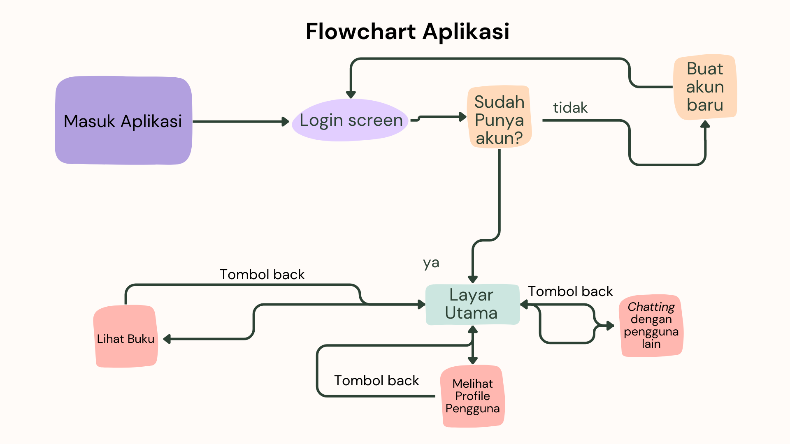

# UlasBuku - Aplikasi Review Buku

## Anggota Kelompok

- Darrel Danadyaksa Poli (2206081995)
- Adrasa Cantya Salaka (2206829603)
- Surya Raavi Adiputra (2206082404)
- Dhemas Wicaksono Nugroho (2206030786)

## Deskripsi Aplikasi

Judul Aplikasi: **UlasBuku**

**UlasBuku** adalah sebuah aplikasi yang memungkinkan pengguna untuk memberikan ulasan dan review terhadap buku-buku yang telah mereka baca. Aplikasi ini memungkinkan pengguna untuk berbagi pengalaman membaca mereka dan memberikan informasi berguna kepada orang lain yang ingin membaca buku tersebut.

## Modul Aplikasi

Aplikasi **UlasBuku** akan memiliki beberapa modul utama, termasuk:

1. **Forum Buku**: Pengguna dapat berpartisipasi dalam diskusi dan berbagi ulasan tentang buku-buku tertentu.
2. **Tambah Buku**: Pengguna dapat menambahkan informasi tentang buku-buku yang telah mereka baca.
3. **Profile**: Pengguna dapat melihat profil mereka sendiri.
4. **Pesan Sesama Pengguna**: Pengguna dapat berkomunikasi satu sama lain melalui pesan.

## Sumber Data

Data buku akan diambil dari API yang telah dibuat pada tugas kelompok yang dikerjakan sebagai proyek tengah semester. Data yang diambil tersebut diperoleh melalui [**Kaggle**](https://www.kaggle.com/datasets/arashnic/book-recommendation-dataset/). API ini akan memberikan informasi tentang buku-buku yang tersedia, termasuk judul, penulis, tahun publikasi, penerbit, dan sampul buku.

## Peran Pengguna

Aplikasi **UlasBuku** akan memiliki beberapa peran pengguna beserta deskripsinya:

1. **Unregistered User**: Pengguna yang belum mendaftar atau login.
   - Melakukan login.
   - Melakukan registrasi.


2. **Registered/Login User**: Pengguna yang telah mendaftar dan login.
   - Melihat forum buku.
   - Berpartisipasi dalam diskusi forum.
   - Melihat rekomendasi buku di homepage.
   - Menambahkan informasi tentang buku yang telah mereka baca.
   - Mengirim dan menerima pesan dari pengguna lain.
   - Melihat profil diri sendiri.

## Alur Pengintegrasian dengan web service

Login dengan menggunakan fetch dari website django yang telah dibuat. Kemudian bisa melihat buku-buku yang sudah ada. Lalu bisa membuat review baru terhadap sebuah buku.

Selain itu, berikut adalah _flowchart_ penggunaan aplikasi kami:



# Cara Berkontribusi

Terima kasih atas minat Anda untuk berkontribusi pada pengembangan aplikasi UlasBuku. Kami sangat menghargai setiap kontribusi yang dapat meningkatkan fungsionalitas dan kualitas aplikasi ini. Berikut adalah langkah-langkah untuk berkontribusi:

## Buat Fork Repositori

Fork repositori UlasBuku ke akun GitHub yang kamu miliki. Hal ini dapat dilakukan dengan menekan tombol "Fork" di sudut kanan atas halaman repositori.

## Clone Repositori ke Mesin Lokal Anda

Salin repositori yang telah kami fork ke mesin lokal yang kamu miliki. Gunakan perintah berikut di terminal Anda:

```bash
git clone https://github.com/kelompok-e10/UlasBuku-Mobile.git
```

## Buat Cabang Baru

Pindah ke direktori proyek dan buat cabang baru untuk pekerjaan Anda:

```bash
cd UlasBuku
git checkout -b fitur-anda
```

Gantilah "fitur-anda" dengan nama deskriptif untuk fitur atau perbaikan yang telah dikerjakan.

## Lakukan Pekerjaan Anda

Lakukan perubahan yang diperlukan pada kode atau dokumentasi sesuai dengan tujuan kontribusi Anda.

## Uji Perubahan Anda

Pastikan untuk menguji perubahan Anda dengan seksama. Jalankan tes yang ada atau tambahkan tes baru jika perlu. Pastikan bahwa tidak ada kesalahan yang muncul.

## Commit dan Push

Setelah Anda yakin perubahan Anda berfungsi dengan baik, commit perubahan dan dorong ke cabang Anda di repositori GitHub:

```bash
git add .
git commit -m "Deskripsi perubahan Anda"
git push origin fitur-anda
```

## Buka Pull Request (PR)

Buka Pull Request di repositori utama. Pastikan untuk memberikan deskripsi yang jelas tentang perubahan Anda. Jika PR Anda terkait dengan masalah tertentu, cantumkan nomor masalahnya.

## Diskusi dan Pembaruan

Setelah mengajukan PR, tim akan melakukan peninjauan kode. Anda mungkin perlu melakukan perubahan tambahan atau memberikan klarifikasi. Silakan berpartisipasi dalam diskusi untuk memastikan perubahan Anda memenuhi standar proyek.

## Penerimaan Kontribusi

Setelah revisi dan diskusi selesai, kontribusi Anda akan diterima dan diintegrasikan ke dalam repositori utama.

## Selalu Sinkronkan dengan Repositori Utama

Pastikan untuk selalu mengikuti perubahan di repositori utama. Gunakan perintah berikut untuk menambahkan repositori utama sebagai remote dan mengambil perubahan terbaru:

```bash
git remote add upstream https://github.com/kelompok-e10/UlasBuku-Mobile.git
git fetch upstream
git merge upstream/main
```

Jangan ragu untuk menghubungi kami jika Anda memerlukan bantuan atau memiliki pertanyaan. Kami menghargai setiap kontribusi yang Anda berikan untuk meningkatkan kualitas dan fungsionalitas aplikasi UlasBuku. Terima kasih!

# Tautan Berita Acara

Tautan berita acara dapat dilihat pada [tautan berikut](https://docs.google.com/spreadsheets/d/17apHL7ozM74HWTzj6h73pk9-J-Uv__YU/edit#gid=2005070693)

# Tautan APK

APK UlasBuku dapat diakses melalui [tautan berikut](https://install.appcenter.ms/orgs/ulasbuku-mobile/apps/ulasbuku-mobile/distribution_groups/public)

Build Status: [](https://appcenter.ms)

## Lisensi

Aplikasi ini akan dilisensikan di bawah [lisensi MIT](LICENSE).

---

**Catatan**: Aplikasi **UlasBuku** masih dalam tahap pengembangan awal. Kami berharap aplikasi ini akan menjadi platform yang berguna bagi pembaca buku untuk berbagi pengalaman mereka dan memperluas wawasan literasi. Terima kasih atas dukungan Anda!
